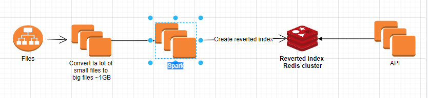

#### Words Counter POC
Inverted Index & Map Reduce
Given a potentially very large set of documents. Some of the documents are also very large and cannot fit 
into the memory of a single machine. Design and implement a search engine. 
Example 1: Suppose you have a local copy of Wikipedia which comes in the form of a ZIP file. Each file in
the ZIP archive corresponds to the Wikipedia article and file names correspond to article names. Given a search query
‘a computer science’ , the designed engine will return all documents containing both the words: ‘computer’ and ‘science’.

#### Assumptions
- Elastic search can not be used, because it can do the same and even better
- POC contains only single threaded application that read files direrctory and 



 Suggested solution: 
- Preprocessing service to unzip archive
- Read and map & reduce files using Spark 
- Save inverted index in Redis or other key/value store
##### Alghorithm:
Basically for each file created callable task, that submitted to executor pool. Each task read line by line text file,
parse to words( map function ) and updates words counters( reduce function ) in shared concurrent map.   
Main is located in WordsCounter.
Concurrency level, used by to define executor pool size and concurency level in shared concurent hash map.
To assure that no race condition will occur, for updates in in concurrent map is used computeIfAbsent method. Also used
LongAdder as counter.
##### Indexing:
- Going to ignore casing, grammatical tenses, "stop words" (most common words in a language, e.g., the, is, at, which, on, etc.).
- Build an Inverted Index from parsing the documents. Given a query the index can return the list of documents relevant for it.
- Each vocabulary term is a key in the index whose value is its documents list.
- Inverted index will also contain additional information such as: overall number of occurrences (frequency), occurrence position in each document.
  Parse each document:
  Lower case all input.
  Extract tokens; Token = alphanumeric [a-z0-9] characters terminated by a non-alphanumeric character.
  Filter out stop words.
  Inverted index will be a (distributed) hash table in memory: Map<String, List<WordMetadata>>.
##### Main classes involved:
com.wordscounter.SingleFileProcessor
com.wordscounter.WordsCounter
com.files.FileIterator
```
gradlew wordsCounterSmall // to run three small files and print inverted index

gradlew wordsCounterLarge // to run three bigger files and print inverted index
```
Tests: Search tests are included
com.ascii.WordsCounterTest
```
gradlew tests 